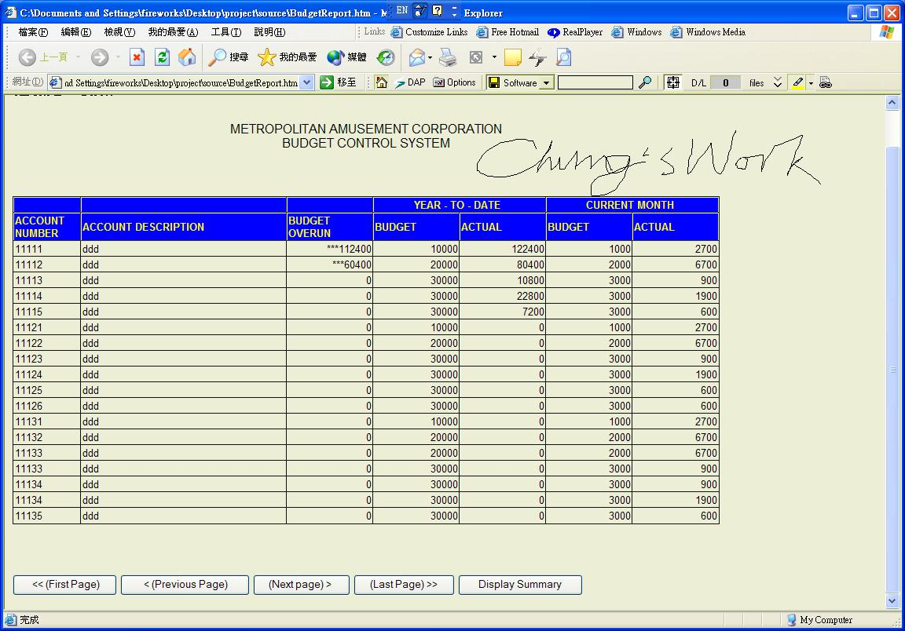



## html report using xml, dom, vbscript with page navigation

### Description

it's is a part of my assignment,

firstly the main program generates the xml file, then the html file reads the xml file into a table.

in order to print the table properly, i add some button to facilitate paging of the report so that it could print properly into the printer.
 
### More Info
 
a xml file, xmlbudget.xml

xml dso, basic xml, javascript, Dom(document object model)

a report

             |
---                |---
**Submitted On**   |2001-10-01 16:39:44
**By**             |[WM Chung](https://github.com/Planet-Source-Code/PSCIndex/blob/master/ByAuthor/wm-chung.md)
**Level**          |Intermediate
**User Rating**    |4.4 (22 globes from 5 users)
**Compatibility**  |VB Script
**Category**       |[Internet/ HTML](https://github.com/Planet-Source-Code/PSCIndex/blob/master/ByCategory/internet-html__1-34.md)
**World**          |[Visual Basic](https://github.com/Planet-Source-Code/PSCIndex/blob/master/ByWorld/visual-basic.md)
**Archive File**   |[html repor272771012001\.zip](https://github.com/Planet-Source-Code/wm-chung-html-report-using-xml-dom-vbscript-with-page-navigation__1-27687/archive/master.zip)

